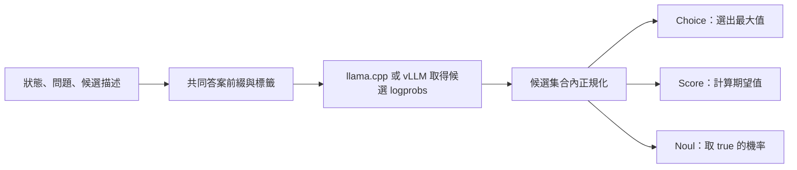

# 讓 LLM 輸出決策機率：用 vLLM 與 llama.cpp 實作 Jev 風格的判斷

一件客服案件應該交給哪個團隊？一則警示有多嚴重？現在是否需要通知值班工程師？程式會根據這些答案，決定後續處理流程。應用程式需要明確的答案，也需要知道模型在幾個答案之間有多猶豫。

Jev 的決策介面提供了一種設計方式：把待判斷的資料、判斷規則與候選答案分開，回傳分類結果、分數，或「是」的機率。我們也能用通用語言模型搭配 vLLM 或 llama.cpp，建立相同風格的能力。核心是**讀取模型對候選答案的機率，再把分布轉成程式可使用的決策**。

這裡重建的是決策輸出的機制與結構。實際判斷能力仍來自載入的模型；採用與 Jev 相同的回應格式，並不代表重現了 Jev 的訓練、校正或推論架構。

## 先把問題變成可比較的選項

假設目前的狀態是：「新版上線後，所有使用者登入都回傳 500，重試無效。」同一份資料，可以用來做三個不同的判斷：

| 想知道的事 | 判斷方式 | 候選答案 |
| --- | --- | --- |
| 誰先處理？ | Choice | 身分驗證、帳務、前端 |
| 影響多嚴重？ | Score | 0：功能正常；1：部分受影響；2：核心功能中斷 |
| 是否立即升級？ | Noul | 是、否 |

在 Jev 的語彙裡，事實放進 `state`，問題放進 `instructions`，候選的意義與邊界放進 `criteria`。Choice 回傳選項及其分布，Score 表達有順序的等級，Noul 表達「是」的機率。三者的定義可見官方的 [Choice](https://docs.typesafe.ai/primitives/choice)、[Score](https://docs.typesafe.ai/primitives/score) 與 [Noul](https://docs.typesafe.ai/primitives/noul) 文件。

這個拆法把「模型要判斷什麼」寫清楚了。身分驗證團隊與前端團隊的責任若有重疊，就需要在選項描述中釐清；若輸入可能不屬於任何一類，就應加入「其他」或「資訊不足」。候選集合決定了模型能表達哪些答案，也決定了它無法表達哪些不確定性。

## 機率來自模型的答案分布

語言模型在生成下一個 token 前，會先計算各 token 的分數。一般聊天介面最後呈現抽選出的文字；決策介面可以保留候選答案的分數，讓應用程式看見選項之間的差距。

以「誰先處理」為例，先把身分驗證、帳務、前端對應到 A、B、C，並在題目中交代各標籤的意義。接著固定答案開始的位置，讀取 A、B、C 的 logprob，也就是條件機率的對數。使用短標籤，是為了讓每個候選在相同位置各占一個 token，避免直接比較長短不同的答案文字。這個條件必須由 tokenizer 確認，不能只看字母外觀。

假設模型原本分給 A、B、C 的機率分別是 0.40、0.075、0.025，其餘機率落在其他 token。把這三個值除以總和 0.50，就得到候選集合內的分布：

| 選項 | 正規化後機率 |
| --- | ---: |
| 身分驗證 | 0.80 |
| 帳務 | 0.15 |
| 前端 | 0.05 |

若引擎回傳的是 logprob，計算可寫成：

$$
p_i=\frac{\exp(\ell_i)}{\sum_j\exp(\ell_j)},\qquad
\ell_i=\log P(t_i\mid x)
$$

其中，$x$ 是包含狀態、問題與選項的共同前綴，$t_i$ 是代表第 $i$ 個選項的 token。以上數值只是計算範例。

**這個 0.80 表示指定候選之間的相對偏好。** 正規化排除了集合以外的輸出，因此即使三個答案都不適合，仍然會產生一個總和為 1 的分布。它也還不能直接解讀成「這類判斷有 80% 會答對」；後者需要另外用標註資料驗證。

讓模型在 JSON 中寫出 `"probability": 0.8`，得到的是模型生成的數字。本方法的數值則來自推論引擎回傳的 token 分布，來源與計算方式都能明確追蹤。

## 一份分布，三種決策輸出

取得候選分布後，轉換答案只需要簡單的計算。

**Choice 保留分類與替代答案。** 上例會選身分驗證團隊，同時保留帳務與前端的機率。對應用程式而言，`[0.80, 0.15, 0.05]` 和 `[0.36, 0.34, 0.30]` 雖然選出同一個團隊，卻可以觸發不同流程：前者直接分流，後者先交給人工確認。門檻應以任務資料與誤判成本設定。

**Score 將有順序的等級轉成期望值。** 假設功能正常、部分受影響、核心中斷的機率為 `[0.1, 0.2, 0.7]`，分數就是 `0×0.1 + 1×0.2 + 2×0.7 = 1.6`。這讓離散判斷能用於排序，但 1.6 並不是模型找到了一個新的等級，而是等級索引的加權平均。這種算法也假設 0 到 1 與 1 到 2 的差距相同。

平均值會壓縮資訊。全部機率都在等級 1，與一半落在 0、一半落在 2，平均都等於 1；兩種分布代表的判斷狀態卻不同。因此 Score 仍值得保留完整分布。

**Noul 保留「是」的程度。** 若立即升級的兩個候選機率是 `[0.9, 0.1]`，就回傳 0.9。模型負責評分，應用程式再根據漏報與誤報的代價決定是否採取行動。同一個分數，在一般通知與高成本處置中可以使用不同門檻。

## vLLM 與 llama.cpp 負責把分數取出來

兩個引擎在這裡扮演的角色相同：執行模型，並提供候選 token 的分數。套件負責將問題轉成候選選項、確認讀取分數的位置，並組成三種決策輸出。

本專案將兩種讀值路線封裝在同一個 `jev` 套件中。應用程式使用相同的 Jev 風格介面，以 `OPENAI_BASE_URL` 指定網址；套件查詢服務的模型資訊後自動選擇後端：

| 路線 | 直覺理解 | 需要注意的事 |
| --- | --- | --- |
| llama.cpp：讀取下一個 token 的分布 | 在同一個答案位置，看 A、B、C 各有多少分數 | 回傳的前幾名 token 可能沒有包含全部候選 |
| vLLM：逐一評分放入輸入的候選 | 分別詢問「在這個共同前綴後，接 A／B／C 的機率是多少」 | 每個候選必須使用相同前綴，取到的必須是答案 token 的分數 |

llama.cpp 路線會在候選缺漏時擴大讀取範圍；仍然取不到就停止，避免用補零的方式製造完整分布。vLLM 路線使用 prompt logprobs，直接讀取輸入中候選 token 的條件機率，即使它不在最可能的前幾名也能評分。這種把候選放入輸入、計算其條件機率的方式稱為 teacher forcing。介面依據見 [llama.cpp server 文件](https://github.com/ggml-org/llama.cpp/blob/master/tools/server/README.md) 與 [vLLM Chat Completions protocol](https://docs.vllm.ai/en/latest/api/vllm/entrypoints/openai/chat_completion/protocol/)。

這是本專案的實作選擇，並非兩個引擎能力的完整劃分。對決策品質而言，更重要的是：所有候選是否在相同條件下比較、答案位置是否正確，以及分數是否完整。若讀到的是換行或推理文字的機率，即使輸出格式正確，數字也沒有回答原本的問題。

同一份狀態可以衍生多個問題，同時送出這些請求有助於引擎安排工作。但少生成文字不代表不需要處理長輸入；逐候選評分也可能增加計算。是否能重複利用前綴、每秒能處理多少請求，都應實測，不能從回應只有一個字母就推斷成本。

## Gemma 4 的小型觀察：格式成立後，品質仍取決於模型

[docs/gemma4-results](docs/gemma4-results/) 保存了一批使用 Gemma 4 E2B、E4B、12B IT QAT、UD-Q4_K_XL 量化模型的結果。紀錄使用 CPU-only 的 llama-server b11153，透過單字母限制與 logprobs 產生 Jev 風格輸出。這是既有評測流程的結果，並非本專案兩種後端流程的對照測試，也沒有 vLLM 跑分。

| 模型 | JevBench 公開集（231 題） | 其中 hard（111 題） | TMMLU+ 困難子集（7,862 題） |
| --- | ---: | ---: | ---: |
| E2B | 66.7% | 45.0% | 34.8% |
| E4B | 77.5% | 55.0% | 48.4% |
| 12B | 86.1% | 73.0% | 57.1% |

數字取自各模型的 `summary.json`，題數與正確數見[完整評測報告](docs/evaluation.md)。JevBench 僅含公開題；TMMLU+ 使用 v1.1 test 中選出的 23 科，兩者都不能當作對應基準的完整官方分數。JevBench 的 Score 題以期望等級四捨五入計分，另有記錄 argmax 指標。

這組結果最值得注意的是難題的差距。JevBench easy 三個模型都是 100%，hard 卻從 45.0% 上升至 73.0%。在這批題目與設定中，12B 的答對率較高；即使都只輸出一個 token，各模型的判斷能力仍有差距。

另一個觀察是高信心錯誤。12B 在 TMMLU+ 子集中，有 3,559 題的 confidence 至少為 0.85，其中 **764 題答錯，占這群題目的 21.5%**。這裡的 confidence 是由分布熵計算的集中程度，並不是最大選項機率，也不是已校正的答對率。它提醒我們：模型可以很明確地偏向錯誤答案。逐題紀錄與案例見[案例分析](docs/evaluation-cases.md)。

## 從機率輸出走到可用的決策

本專案的實作用正規化熵描述分布的集中程度：選項越平均，confidence 越低；機率越集中，confidence 越高。這是本專案採用的定義，不能假設與 Jev 的數值完全相同。TypeSafe 也將 confidence 描述為分布形狀的函數，並指出它不是「模型答對的機率」。參見 [Confidence 文件](https://docs.typesafe.ai/confidence)。

實際導入時，需要分開回答三個問題：模型是否常常選對、分數能否反映錯誤風險，以及採取行動的門檻是否符合任務成本。準確率只能回答第一個問題；檢查機率還需要可靠度分組、Brier score 或 NLL 等量測。若以溫度調整分布，應使用獨立校正集，再以未參與調整的資料驗證。

選項順序、描述措辭、模型量化與對話範本也都是評分流程的一部分。更換其中任何一項，都可能改變分布。保留測試集與完整候選機率，才能判斷一次改動究竟改善了分類，還是只讓模型更有把握。

部署範例統一使用官方 Docker 映像啟動 Gemma 4 12B，Python 用戶端由 uv 管理。環境建立見 [README.md](README.md)；[後端實作](docs/backends.md)、[Python 介面](docs/python-api.md)與[評測報告](docs/evaluation.md)分開收錄操作細節。
